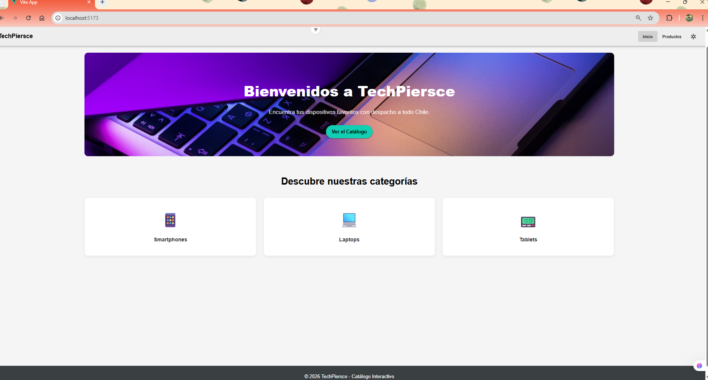
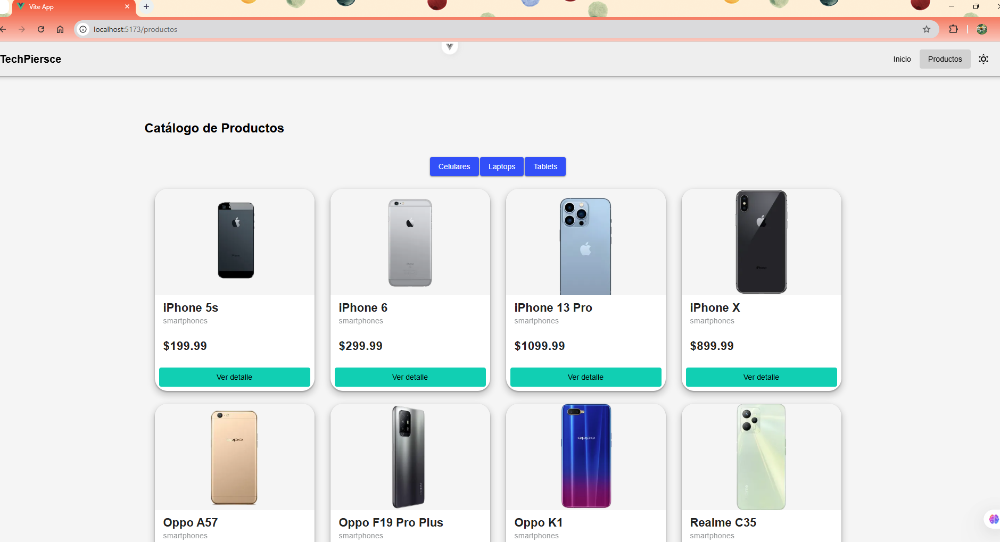
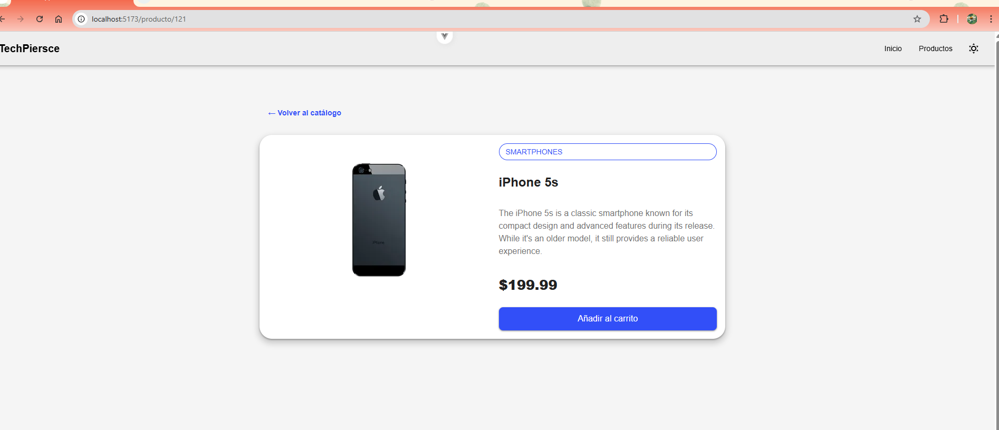
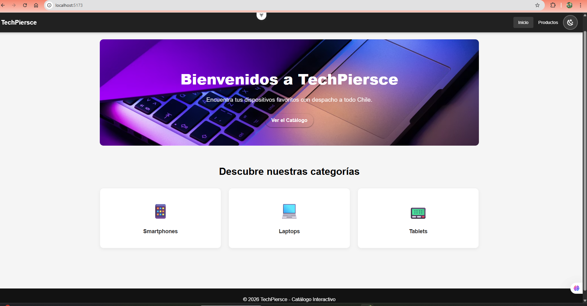
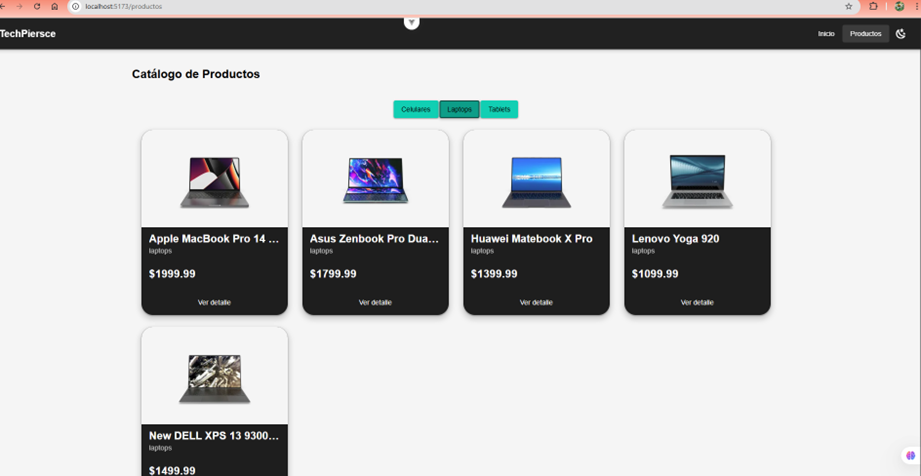
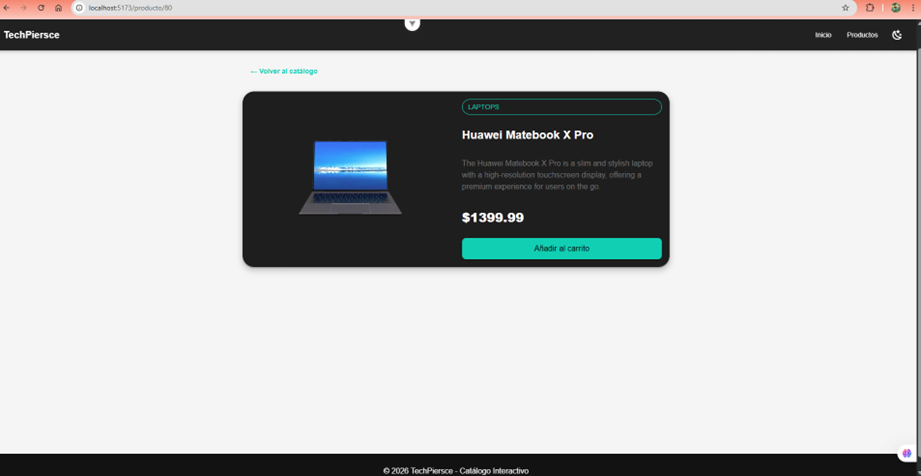

# TechPiersce 

Aplicación SPA desarrollada con **Vue 3 + Vite** que permite visualizar un catálogo interactivo de productos, consumir datos desde una API y gestionar el estado global de forma centralizada.

---

## Descripción

TechPiersce es una aplicación de e-commerce ficticia que permite:

* Visualizar productos dinámicos desde una API
* Filtrar por categorías
* Ver el detalle de cada producto
* Cambiar entre modo claro y oscuro
* Navegar de forma fluida mediante SPA

---

## Tecnologías utilizadas

* Vue 3
* Vite
* Pinia (gestión de estado)
* Vue Router
* Vuetify 
* Axios (consumo de API)
* itest + Vue Test Utils (pruebas unitarias)
* Cypress (pruebas E2E)

---

## API utilizada

Se utilizó la API pública:

https://dummyjson.com/products

Permite obtener productos por categoría y visualizar detalles individuales.

---

## Gestión de estado

Se utilizó **Pinia** para:

* Manejar productos globalmente
* Controlar estados de carga (`loading`)
* Manejar errores (`error`)
* Obtener productos por categoría

---

## Pruebas

### Pruebas unitarias (Vitest)

* Renderizado correcto de `ProductoCard`
* Manejo de errores en `ProductList`

---

### Pruebas E2E (Cypress)

Se valida el flujo completo del usuario:

* Navegación al catálogo
* Filtrado de productos
* Visualización de resultados

---

## Tema claro / oscuro

Se implementó un sistema de temas utilizando:

* Pinia (`themeStore`)
* Vuetify (`theme.change()`)

Incluye un botón en el header para alternar entre modo claro y oscuro.
Nota: Considerar como una mejora futura.

---

## UI y diseño

Se utilizó **Vuetify** para:

* Componentes visuales (cards, botones, grids)
* Diseño responsive automático
* Consistencia visual

---

## Decisiones técnicas

### Vuetify vs Quasar

Se eligió Vuetify por su simplicidad e integración con Vue 3.

Sin embargo, **Quasar** fue considerado como alternativa debido a:

* Soporte para aplicaciones móviles y desktop
* Mayor escalabilidad
* CLI avanzada

Se deja como posible mejora futura.

---

## Mejoras futuras

* Implementar carrito de compras
* Persistencia de datos
* Login de usuario
* Migración a Quasar
* Tema claro/oscuro

## Capturas

* Inicio pagina web tema claro

* Catálogo de productos tema claro

* Detalle producto tema claro

* Inicio pagina web tema oscuro

* Catálogo de productos tema oscuro

* Detalle producto tema oscuro

---

